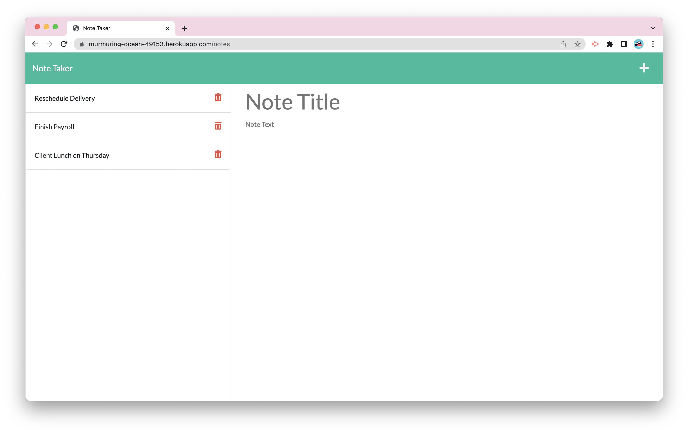

# Note Taker

  
  
    
  
  ## Description

  Note Taker is a full stack application that allows for users write and save notes. The application uses Express.js in the back end to retrieve notes stored from a JSON file.  
   

  ## Table of Contents

  - [Installation](#installation)
  - [Usage](#usage)
  - [License](#license)
  - [Questions](#questions)  
   

  ## Installation

  Use the following command to download dependencies for the project:  
  ~~~
  $ npm install
  ~~~
   

  ## Usage

  Notes with a title and text body can be saved onto the left hand column. If a saved note is clicked, the enlarged note will be showed on the right. If the note is deleted, the entire note will be removed from the JSON file. Clicking on the write application on top write will present empty fields to write a new note.  
   
    
   

## License 

  This project is licensed under the [Mozilla Public 2.0 License](https://choosealicense.com/licenses/mpl-2.0/).  
   
  
  ## Questions

  [GitHub](https://github.com/dneflas)  
